# 🎞️영화 데이터 프로젝트🎞️
## 👨‍👧‍👦팀원 정보
### 팀장 : 최영빈
### 팀원 : 신희진, 연상헌
---
### 업무 분담
#### 최영빈
- 영화추천 알고리즘 제작, 웹페이지에 장르별, 배우별 영화 추천기능 구현
#### 신희진
- 커뮤니티 페이지 구현, 생성형 ai기능 구현, 닮은 꼴 배우 찾기, CSS
#### 연상헌
- 데이터베이스 설계, 사용자 가입, 로그인 ,로그아웃 기능 구현

### 목표 서비스
- 회원가입 시 좋아하는 영화를 입력하고, 구독중인 OTT를 입력하면 알고리즘에 따라 장르별, 배우별 좋아하는 영화를 추천해주는 사이트를 만들기로 함.
- 추가로 회원가입 없이도 최고 평점, 최다 투표, 개봉 예정일의 영화를 메인페이지에 보여주기로 함.
- 회원가입을 하고 정보 입력 시 메인페이지에 구독한 OTT의 인기영화가 추가로 표시되고, navbar의 추천영화 링크를 들어가면 알고리즘에 따라 장르별, 배우별 각각 10개의 영화 추천.
- 커뮤니티 기능으로 게시판 CRUD 이외에도 생성형 AI를 이용해 선택지를 통해 자신의 캐릭터를 이용한 영화 포스터를 만들어주는 기능과 사진을 넣으면 가장 비슷한 배우를 보여주는 기능 구현.

### ERD
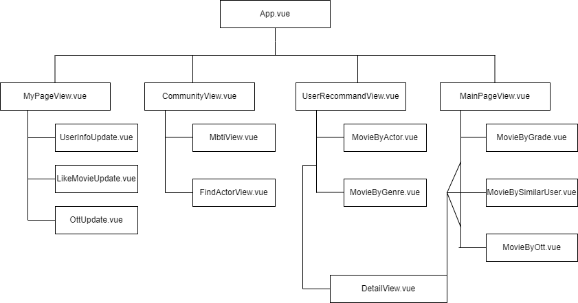

### 핵심 기능에 대한 설명
- 메인 페이지: 메인페이지는 navbar와 영화 검색창, 배경에는 짧은 영화속 장면들로 이루어져 있다. 검색창 밑에는 각 항목별 추천 영화 목록이 있고 한번에 바로 이동할 수 있는 버튼으로 편의성을 더했다. navbar는 로그인시와 비로그인시에 나타나는 옵션을 다르게 설정했고 구현한 페이지를 바로 갈 수 있게 링크를 설정 했다.

- 마이 페이지: 마이 페이지에서는 현재 로그인한 사용자의 이름이 표시되고, 추가적으로 자신이 좋아하는 영화, 현재 구독중인 OTT를 입력할 수 있다. 3개 이상의 영화를 선택하고, 구독중인 ott를 입력하면 마이페이지에 내가 구독한 ott가 표시되고 선택한 영화가 표시 된다. 반응형으로 만들어져서 화면 너비에 따라 한 줄에 표시할 수 있는 영화갯수가 달라진다.

- 추천영화: 선택한 영화와 ott를 통해 장르별 배우별로 10개의 영화를 추천한다.

- 영화 상세페이지 : 영화의 포스터를 클릭하면 해당 영화 상세페이지로 넘어간다. 상세페이지에는 평점, 장르, 배우, 줄거리, 시청할 수 있는 ott 목록들을 볼 수 있으며 상세페이지에서 좋아요를 누른 영화는 마이페이지에도 추가가 되어 추천영화가 갱신된다.

- 커뮤니티 페이지
  - 메인 페이지: 작성된 게시글들을 볼 수 있는 페이지이고 각 게시글마다 댓글을 달거나 좋아요를 누를 수 있다.
  - New Post: 사진을 업로드 하고 게시글을 작성할 수 있다. 사진은 필수 값으로 들어가게 했다.
  - Profile: 커뮤니티 페이지의 프로필 페이지로 자신이 작성한 게시물의 수, 내 게시물에서 받은 총 좋아요 수, 내가 작성한 게시글들을 볼 수 있다. 프로필 수정란에는 자신의 프로필 사진을 업로드 할 수 있다.
  - 닮은 꼴 배우찾기: 사진을 업로드 시키면 사진과 비슷한 배우를 보여줌
  - 이미지 생성: 몇 개의 질문을 통해 자신의 캐릭터가 나온 영화 포스터를 보여줌

---
### 정리

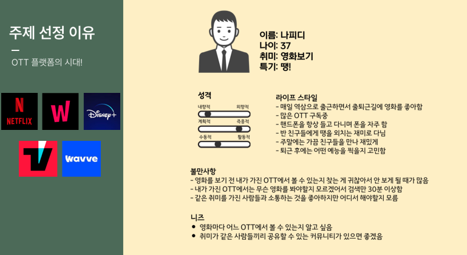
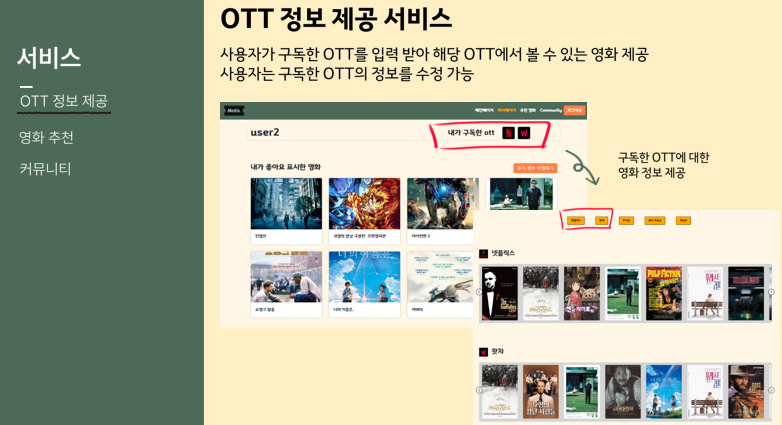
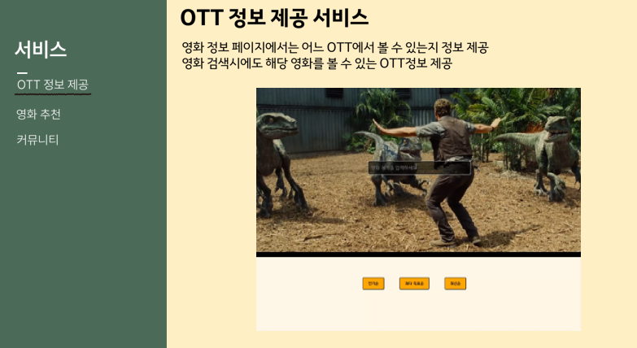
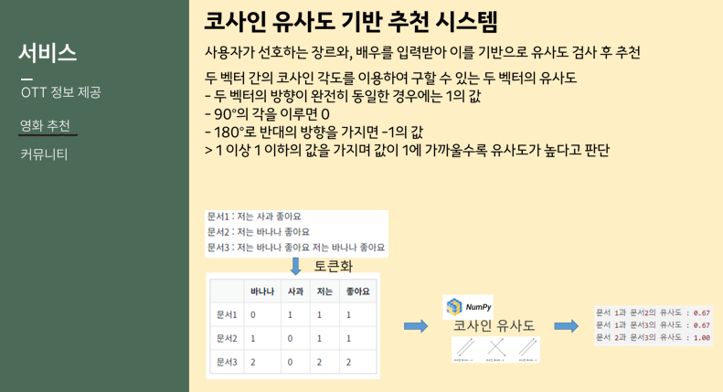
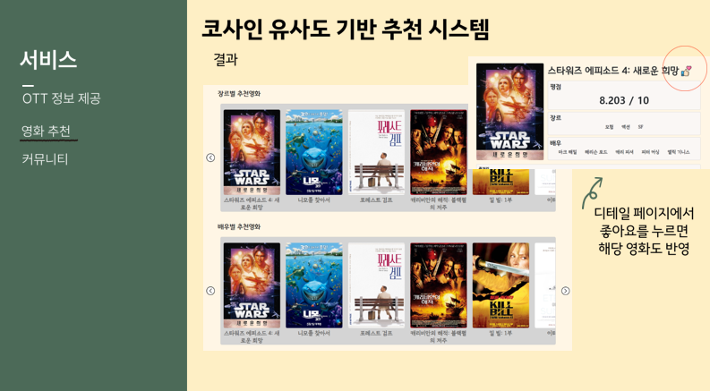
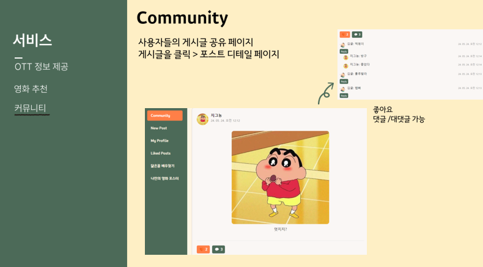
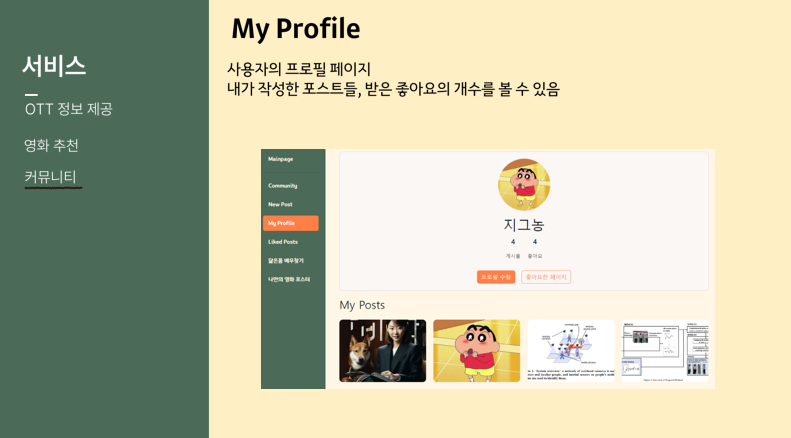
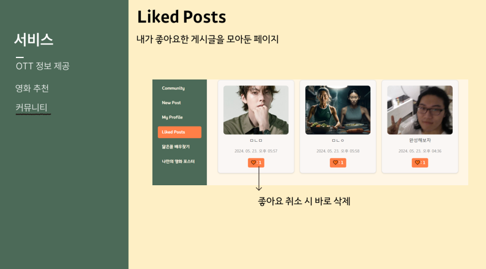
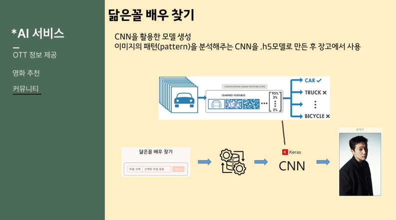
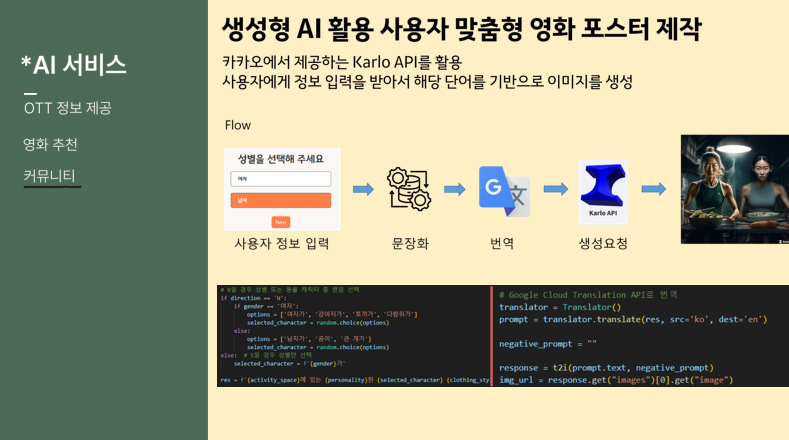

### 느낀점, 후기
- 상헌 : 길다면 길고 짧다면 짧은 일주일간의 최종 프로젝트도 끝이 보인다. 처음에 시작할 때만해도 이렇게 다양한 오류가 생길 줄 몰랐고 우리가 쉽게 접할 수 있었던 페이지 하나를 만드는데도 수많은 것들을 생각해서 선택이 필요한 것도 몰랐다. 설명 잘 돼있는 교안도 있겠다 최대한 많은 기능을 구현해보자고 생각하던 것도 잠시 페이지에 쓸 영화 데이터를 받는 것부터 데이터에서 어떤 부분을 가져와야 하는지 또 어떤 관계를 설정해야 하는지 등등의 생각할 부분이 늘어났고 예상했던 것보다 시간을 더 쓰게 되었다. 머리로만 알고있던 것을 직접 쓰는데 익숙하지 않아서 코딩이 느려지기도 했고 기능을 구현하는데 한가지 방법만을 고집할 필요 없다는 것도 이번에 확실히 알게 되었다. 이번에는 1학기에 배운 내용들을 이용해서 페이지 주요기능들을 구현하는데 중점을 두고 작업을 했지만 다음 프로젝트에는 추가적인 기술을 찾아봐서 필수 기능 구현 뿐만 아니라 여러가지 기능들을 추가해보고 싶다.
